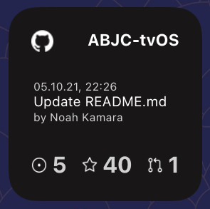

# ScriptablePublic

## [GithubRepo](GithubRepo/GithubRepo.js)
A Script to show some basic info about a repository

## [DiscordServerPresence](DiscordServerPresence/DiscordServerPresence.js)
A Script to shows the online members of a discord server

| Small Light | Small Dark | Medium Light |
|---|---|---|
|  |  |  |

## [Pollenflug](GithubRepo.js)
A Script to show pollen warnings for a specific region (Germany) - configuratble through constants in the script
